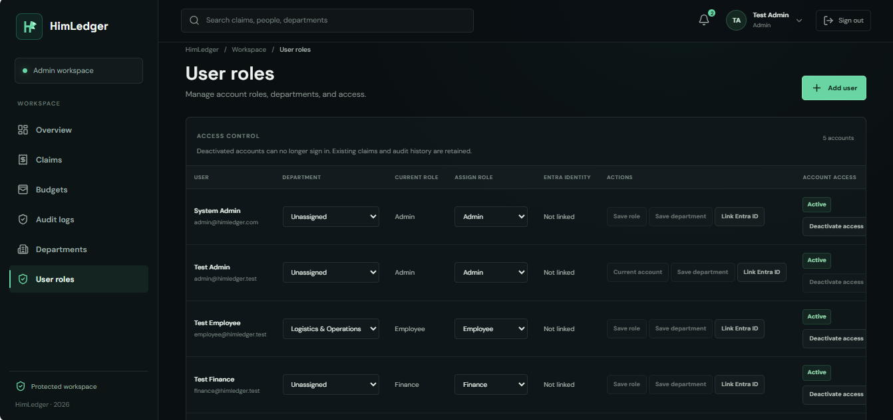
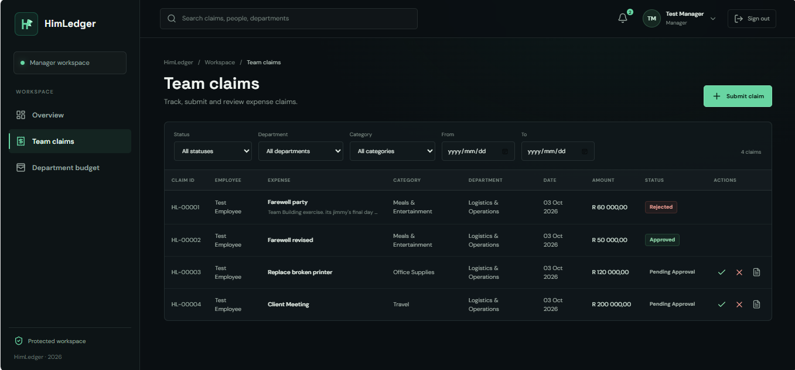

# HimLedger

Corporate expense operations, powered by precision.

HimLedger is a full-stack expense and budget control platform built for logistics, freight, and modern enterprise teams. It gives employees a simple way to submit claims, helps managers review and approve them consistently, and gives finance and admin teams a single place to track budgets, control access, and keep an immutable audit trail.

## Why teams use HimLedger

- Policy-aware expense submission and review
- Department-level budget tracking and approval guardrails
- Role-based workspaces for employees, managers, finance, and admins
- Audit logs for claim history and account-level access changes
- Receipt handling with secure storage and reconciliation workflows
- Clear operational visibility for approvals, outstanding spend, and reimbursement

## Product highlights

- Employee workspace for submitting and tracking claims
- Manager workspace for reviewing team spend and approval actions
- Finance workspace for budget monitoring and reimbursements
- Admin workspace for departments, user roles, and audit visibility
- Immutable activity ledger to support operational review and accountability

## Screenshots

### Landing page


### Admin overview dashboard


### Audit log workspace


### User roles management



### Employee claims workspace


### Team claims review workflow



## Architecture

HimLedger is split into three main parts:

- Frontend: React + TypeScript + Vite
- Backend: ASP.NET Core + .NET 8 API
- Data and infrastructure: SQL Server, Azure Blob Storage, Azure App Service, Key Vault, Application Insights

### Stack

- Frontend: React 19, Vite, Tailwind, React Router, TanStack Query
- Backend: ASP.NET Core Web API, Entity Framework Core, SQL Server
- Security: Entra ID authentication support, local JWT dev mode, role-based authorization
- Deployment: Azure infrastructure-as-code with Bicep

## Repository layout

```text
.
├── backend/                 # .NET API, domain, infrastructure, tests
│   ├── HimLedger.Api/
│   ├── HimLedger.Application/
│   ├── HimLedger.Domain/
│   ├── HimLedger.Infrastructure/
│   ├── HimLedger.Domain.Tests/
│   ├── HimLedger.Api.IntegrationTests/
│   ├── HimLedger.sln
│   ├── HimLedger.Schema.sql
│   └── README.md
├── frontend/                # React + Vite app
│   ├── src/
│   ├── package.json
│   └── README.md
├── infra/                   # Azure deployment configuration
│   ├── main.bicep
│   └── README.md
├── docs/
│   └── screenshots/
├── CONTRIBUTING.md
├── .gitignore
└── README.md
```

## Local development

### Prerequisites

- .NET 8 SDK
- Node.js 22+
- SQL Server instance for local development (or use the checked-in local development configuration)

### 1) Restore and run the backend

```powershell
dotnet restore backend\HimLedger.sln
dotnet ef database update --project backend\HimLedger.Infrastructure --startup-project backend\HimLedger.Api
dotnet run --project backend\HimLedger.Api --launch-profile http
```

The API will run on the local development endpoint used by the frontend, and Swagger is available through the app's OpenAPI endpoint.

### 2) Install and run the frontend

```powershell
cd frontend
npm ci
npm run dev
```

Then open:

```text
http://localhost:5173/login
```

### Local test accounts

The development environment includes seeded test accounts. These are documented in the backend README and are intended only for local testing.

- Admin: `admin@himledger.test`
- Manager: `manager@himledger.test`
- Employee: `employee@himledger.test`
- Finance: `finance@himledger.test`

Default password:

```text
test1234
```

## Quality and validation

The project includes CI checks for both the backend and frontend. See the repository guidance in [CONTRIBUTING.md](./CONTRIBUTING.md) for the expected validation workflow.

Typical checks:

```powershell
dotnet build backend\HimLedger.sln --configuration Release
dotnet test backend\HimLedger.sln --configuration Release

cd frontend
npm run lint
npm run test:unit
npm run build
```

## Documentation

- [backend/README.md](./backend/README.md) — backend lifecycle, auth, database behavior, and local workflow
- [frontend/README.md](./frontend/README.md) — frontend identity and local app setup
- [infra/README.md](./infra/README.md) — Azure infrastructure and environment deployment
- [CONTRIBUTING.md](./CONTRIBUTING.md) — local validation and CI expectations

## Getting started in one sentence

HimLedger helps organizations run a tighter, more transparent expense process from claim submission through approval, reimbursement, and audit.
