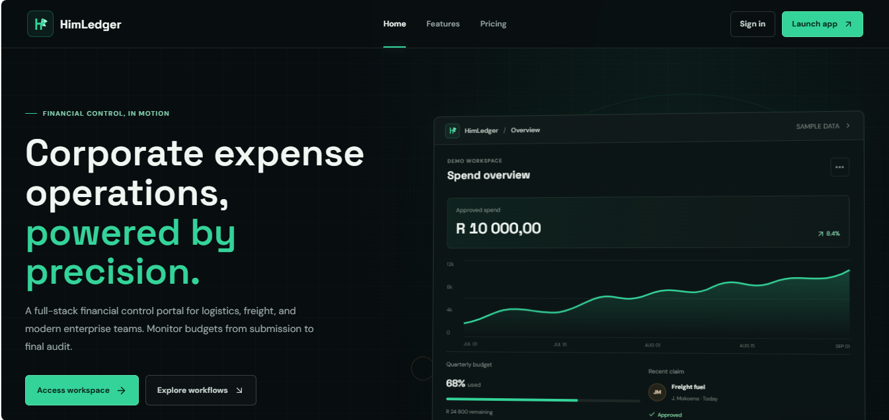
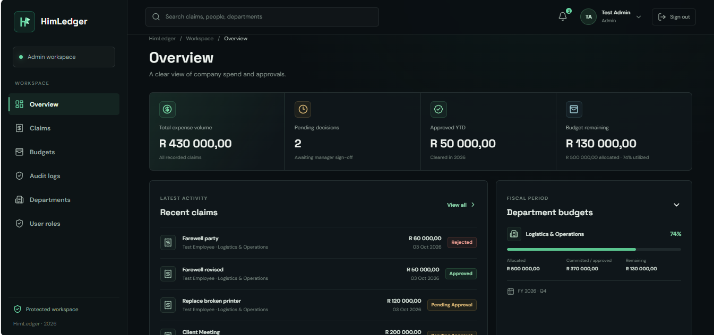
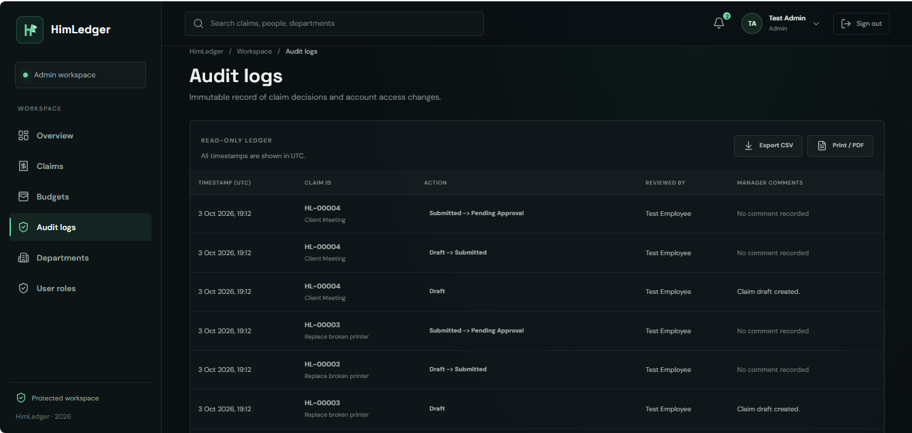
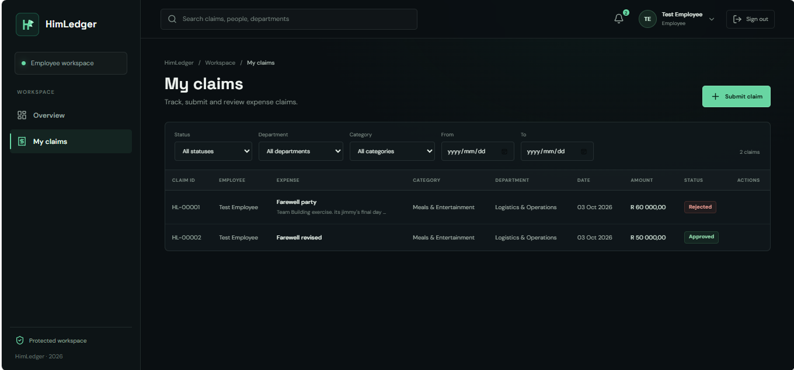

## Overview

**HimLedger** is a full-stack corporate expense management platform designed to bring structure, accountability, and visibility to the employee reimbursement lifecycle.

Instead of relying on disconnected spreadsheets, email chains, manual approvals, and scattered financial records, HimLedger provides a centralized workflow for managing expenses from **submission through approval and audit**.

The platform separates responsibilities across employees, managers, finance teams, and administrators while maintaining a clear operational record of activity.

### The Core Workflow

```text
Employee
   │
   │  Submit expense claim
   ▼
HimLedger
   │
   │  Validation & workflow
   ▼
Manager
   │
   │  Review / Approve / Reject
   ▼
Finance
   │
   │  Financial oversight
   ▼
Reimbursement
   │
   ▼
Audit History
````

The result is a more structured approach to expense operations where every claim has a place, every role has a responsibility, and important activity can be traced.

---

## Why HimLedger?

Expense management becomes difficult when the process grows faster than the tools supporting it.

Employees need a simple way to submit claims.

Managers need a consistent approval process.

Finance teams need visibility into spending.

Administrators need control over users, roles, budgets, and operational activity.

HimLedger brings these responsibilities together into one application.

### Built around five principles

| Principle          | Purpose                                               |
| ------------------ | ----------------------------------------------------- |
| **Clarity**        | Make expense activity easy to understand              |
| **Control**        | Enforce structured approval and access workflows      |
| **Accountability** | Maintain visibility into important actions            |
| **Security**       | Protect financial and operational data                |
| **Scalability**    | Provide an architecture suitable for cloud deployment |

---

# Key Features

## 💳 Expense & Claim Management

Employees can submit and track expense claims through a centralized workspace.

* Create expense claims
* Track claim status
* Attach supporting documentation
* Review historical submissions
* Monitor claim progress

---

## ✅ Approval Workflows

HimLedger provides structured workflows for managerial review.

Managers can:

* Review submitted claims
* Inspect supporting information
* Approve claims
* Reject claims
* Monitor outstanding work

This replaces informal approval processes with a defined operational workflow.

---

## 💰 Budget & Financial Visibility

Financial teams can monitor organizational spending through centralized budget and department-level information.

The platform is designed to provide visibility into:

* Department spending
* Budget utilization
* Expense activity
* Claim volumes
* Financial operations

---

## 👥 Role-Based Access

Different users require different levels of access.

HimLedger separates responsibilities through role-based authorization.

```text
┌─────────────┐
│   Employee  │
└──────┬──────┘
       │
       │ Submit & track
       ▼
┌─────────────┐
│   Manager   │
└──────┬──────┘
       │
       │ Review & approve
       ▼
┌─────────────┐
│   Finance   │
└──────┬──────┘
       │
       │ Financial oversight
       ▼
┌─────────────┐
│    Admin    │
└─────────────┘
```

This keeps functionality aligned with organizational responsibilities.

---

## 🧾 Document & Receipt Handling

Expense claims can contain supporting documents and receipts, allowing financial information to remain associated with the relevant claim.

This provides a more complete record for review and auditing.

---

## 🔎 Audit Visibility

HimLedger is designed around operational transparency.

Important activity can be surfaced through an audit workspace, giving administrators and authorized users a clearer picture of what happened within the system.

Instead of asking:

> "Who changed that?"

the goal is for the system to already have the answer.

---

# Architecture

HimLedger follows a layered full-stack architecture separating the presentation layer, API, business logic, domain model, infrastructure, and cloud resources.

```text
                         ┌─────────────────────┐
                         │      Browser        │
                         └──────────┬──────────┘
                                    │
                                    ▼
                         ┌─────────────────────┐
                         │ React + TypeScript  │
                         │       + Vite        │
                         └──────────┬──────────┘
                                    │
                              HTTP / API
                                    │
                                    ▼
                         ┌─────────────────────┐
                         │    ASP.NET Core     │
                         │        API         │
                         └──────────┬──────────┘
                                    │
                    ┌───────────────┼───────────────┐
                    │               │               │
                    ▼               ▼               ▼
             ┌────────────┐ ┌────────────┐ ┌──────────────┐
             │ Application│ │   Domain   │ │Infrastructure│
             │   Layer    │ │   Layer    │ │    Layer     │
             └────────────┘ └────────────┘ └───────┬──────┘
                                                   │
                                                   ▼
                                           ┌──────────────┐
                                           │ SQL Server   │
                                           └──────────────┘
                                                   │
                                                   ▼
                                           ┌──────────────┐
                                           │    Azure     │
                                           │ Infrastructure│
                                           └──────────────┘
```

### Architectural Layers

#### `HimLedger.Api`

The HTTP-facing ASP.NET Core application.

Responsible for:

* API endpoints
* HTTP configuration
* Authentication and authorization integration
* Dependency injection
* Application startup

#### `HimLedger.Application`

Contains application-level business workflows and use cases.

This layer coordinates operations between the API, domain model, and infrastructure.

#### `HimLedger.Domain`

Contains the core domain model and business concepts.

The domain layer is kept independent from infrastructure concerns wherever possible.

#### `HimLedger.Infrastructure`

Responsible for external persistence and infrastructure concerns.

This includes:

* Entity Framework Core
* SQL Server integration
* Database configuration
* Persistence
* Infrastructure services

#### `HimLedger.Domain.Tests`

Unit tests focused on domain-level behaviour.

#### `HimLedger.Api.IntegrationTests`

Integration coverage for API-level behaviour and interactions between application components.

---

# Technology Stack

## Frontend

| Technology   | Purpose                                |
| ------------ | -------------------------------------- |
| React 19     | User interface                         |
| TypeScript   | Type-safe application development      |
| Vite         | Frontend development and build tooling |
| Tailwind CSS | UI styling                             |
| Vitest       | Unit testing                           |
| Playwright   | End-to-end testing                     |

## Backend

| Technology            | Purpose              |
| --------------------- | -------------------- |
| .NET 8                | Application platform |
| ASP.NET Core          | REST API             |
| Entity Framework Core | Data access and ORM  |
| C#                    | Backend development  |
| xUnit / test stack    | Automated testing    |

## Data

| Technology            | Purpose                                   |
| --------------------- | ----------------------------------------- |
| SQL Server            | Relational data storage                   |
| Entity Framework Core | Database abstraction                      |
| SQL Schema            | Database structure and deployment support |

## Cloud & Infrastructure

| Technology           | Purpose                |
| -------------------- | ---------------------- |
| Microsoft Azure      | Cloud platform         |
| Azure App Service    | Application hosting    |
| Azure Key Vault      | Secret management      |
| Application Insights | Application monitoring |
| Bicep                | Infrastructure as Code |

## Security

* Role-based authorization
* Secure configuration management
* Azure Key Vault integration
* Entra ID support
* Separation of application responsibilities
* Controlled access to operational functionality

---

# Repository Structure

```text
HimLedger/
│
├── backend/
│   │
│   ├── HimLedger.Api/
│   │   └── ASP.NET Core API
│   │
│   ├── HimLedger.Application/
│   │   └── Application services & workflows
│   │
│   ├── HimLedger.Domain/
│   │   └── Core domain models & business rules
│   │
│   ├── HimLedger.Infrastructure/
│   │   └── EF Core, persistence & infrastructure
│   │
│   ├── HimLedger.Domain.Tests/
│   │   └── Domain unit tests
│   │
│   ├── HimLedger.Api.IntegrationTests/
│   │   └── API integration tests
│   │
│   ├── HimLedger.sln
│   ├── HimLedger.Schema.sql
│   ├── README.md
│   └── OPERATIONS.md
│
├── frontend/
│   │
│   ├── src/
│   ├── public/
│   ├── package.json
│   ├── vite.config.ts
│   ├── vitest.config.ts
│   ├── playwright.config.ts
│   └── README.md
│
├── infra/
│   │
│   ├── main.bicep
│   └── README.md
│
├── docs/
│   └── screenshots/
│
├── .github/
│
├── CONTRIBUTING.md
├── .gitignore
└── README.md
```

---

# Getting Started

## Prerequisites

Before running HimLedger locally, make sure you have:

* [.NET 8 SDK](https://dotnet.microsoft.com/download/dotnet/8.0)
* [Node.js 22+](https://nodejs.org/)
* SQL Server
* Git

Verify the installed versions:

```powershell
dotnet --version
node --version
npm --version
```

---

## 1. Clone the Repository

```powershell
git clone <your-repository-url>
cd HimLedger
```

---

## 2. Start the Backend

Restore the .NET solution:

```powershell
dotnet restore backend\HimLedger.sln
```

Apply Entity Framework Core migrations:

```powershell
dotnet ef database update `
  --project backend\HimLedger.Infrastructure `
  --startup-project backend\HimLedger.Api
```

Start the API:

```powershell
dotnet run `
  --project backend\HimLedger.Api `
  --launch-profile http
```

---

## 3. Start the Frontend

Open another terminal:

```powershell
cd frontend
npm ci
npm run dev
```

The frontend will be available at:

```text
http://localhost:5173/login
```

---

# Local Development Accounts

HimLedger includes seeded development accounts for testing different authorization roles.

| Role          | Email                     |
| ------------- | ------------------------- |
| Administrator | `admin@himledger.test`    |
| Manager       | `manager@himledger.test`  |
| Employee      | `employee@himledger.test` |
| Finance       | `finance@himledger.test`  |

Development password:

```text
test1234
```

> ⚠️ These credentials are intended for local development and testing only. Do not use them in production.

---

# Testing & Validation

HimLedger uses automated validation across the backend and frontend.

## Backend Build

```powershell
dotnet build backend\HimLedger.sln --configuration Release
```

## Backend Tests

```powershell
dotnet test backend\HimLedger.sln --configuration Release
```

## Frontend Linting

```powershell
cd frontend
npm run lint
```

## Frontend Unit Tests

```powershell
npm run test:unit
```

## Production Build

```powershell
npm run build
```

A typical validation workflow is therefore:

```text
          ┌──────────────┐
          │  Source Code │
          └───────┬──────┘
                  │
          ┌───────▼──────┐
          │    Build     │
          └───────┬──────┘
                  │
        ┌─────────┴─────────┐
        ▼                   ▼
┌───────────────┐   ┌───────────────┐
│ Backend Tests │   │ Frontend Tests│
└───────┬───────┘   └───────┬───────┘
        │                   │
        └─────────┬─────────┘
                  ▼
          ┌──────────────┐
          │   Validation │
          │   Complete   │
          └──────────────┘
```

---

# Screenshots

HimLedger is designed as an operational application rather than simply an API with a frontend attached.

## Landing Page



The public-facing landing experience introduces the platform and its purpose.

---

## Admin Dashboard



The administrative workspace provides centralized visibility over operational activity.

---

## Audit Log



The audit workspace provides a dedicated view for tracking operational activity and maintaining accountability.

---

## Employee Claims



Employees can manage their expense claims through a dedicated workspace.

---

# Azure & Infrastructure

HimLedger is structured with cloud deployment in mind.

The `infra/` directory contains Azure infrastructure definitions using **Bicep**.

```text
infra/
├── main.bicep
└── README.md
```

The intended cloud architecture supports services such as:

```text
                    Azure
                      │
        ┌─────────────┼─────────────┐
        │             │             │
        ▼             ▼             ▼
   App Service    Key Vault    Application
                                Insights
        │
        ▼
   HimLedger API
        │
        ▼
   SQL Database
```

This separation allows application infrastructure and application code to evolve independently.

---

# Engineering Approach

HimLedger is structured around several engineering principles.

### Separation of Concerns

Frontend, API, application logic, domain logic, and infrastructure are separated into distinct areas.

### Maintainability

The backend follows a layered structure intended to keep business logic from becoming tightly coupled to infrastructure.

### Testability

Domain and API behaviour can be tested independently through unit and integration test projects.

### Security by Design

Authorization, secret management, role separation, and infrastructure boundaries are treated as application concerns rather than afterthoughts.

### Cloud Readiness

Infrastructure is represented as code, making the deployment environment reproducible and easier to maintain.

---

# Documentation

Additional project documentation is available throughout the repository.

| Document                                           | Description                             |
| -------------------------------------------------- | --------------------------------------- |
| [`backend/README.md`](./backend/README.md)         | Backend-specific documentation          |
| [`backend/OPERATIONS.md`](./backend/OPERATIONS.md) | Backend operational guidance            |
| [`frontend/README.md`](./frontend/README.md)       | Frontend development documentation      |
| [`infra/README.md`](./infra/README.md)             | Infrastructure documentation            |
| [`CONTRIBUTING.md`](./CONTRIBUTING.md)             | Contribution and development guidelines |

---

# Project Status

HimLedger is an actively maintained full-stack application with a focus on:

* Expense management
* Claims processing
* Approval workflows
* Budget visibility
* Role-based access
* Auditability
* Automated testing
* Azure deployment

The architecture is intentionally structured so additional operational capabilities can be introduced without turning the codebase into one giant `Controllers` folder and a prayer.

---

# Roadmap

Potential future development areas include:

* Advanced financial reporting
* Expanded dashboard analytics
* Additional approval workflow configuration
* Enhanced notification workflows
* More comprehensive audit reporting
* Expanded Azure deployment automation
* Additional end-to-end test coverage
* Advanced budget forecasting
* Richer administrative controls

> Roadmap items represent potential future development and are not necessarily implemented in the current release.

---

# Contributing

Contributions, improvements, and technical feedback are welcome.

Before opening a pull request:

1. Review [`CONTRIBUTING.md`](./CONTRIBUTING.md)
2. Build the backend successfully
3. Run backend tests
4. Run frontend linting
5. Run frontend unit tests
6. Confirm the production frontend build succeeds
7. Keep changes focused and documented

For larger architectural changes, document the reasoning behind the change rather than simply documenting what changed.

Future-you will appreciate it.

---

# License

This project is currently maintained for internal operational use.

The repository does not currently define a permissive open-source license. Please confirm repository ownership and licensing terms before redistributing, modifying, or commercially using the project.

---

# Built With

HimLedger brings together:

```text
React
   +
TypeScript
   +
Vite
   +
Tailwind CSS
   │
   ▼
ASP.NET Core
   +
.NET 8
   +
Entity Framework Core
   │
   ▼
SQL Server
   │
   ▼
Azure
```

The result is a full-stack platform designed to demonstrate how a modern business application can combine **frontend engineering, backend architecture, relational data, authorization, testing, auditing, and cloud infrastructure** into a single system.

---

<p align="center">
  <strong>HimLedger</strong>
  <br />
  <sub>Make the money trail make sense.</sub>
</p>

<p align="center">
  Built with ☕, C#, TypeScript, and an unreasonable number of database queries.
</p>
```
